# Movie App 

This document outlines the functionality and features of the Movie App, built using the TMDB (The Movie Database) APIs.

## I. Overview

The Movie App provides users with an engaging and intuitive way to explore movies from the TMDB database. With features like browsing trending and top-rated movies, searching for specific titles, managing a personalized wish list, viewing detailed information of movies, watching trailers, and tracking their desired films. The app ensures a seamless and personalized experience.

## II. Features

The app offers the following key features:

**A. Movie Discovery:**

* **Trending Movies:** Displays a list of currently trending movies based on TMDB data.
* **Upcoming Movies:** Shows a list of movies scheduled for release in the near future.
* **Top Rated Movies:**  Displays a list of movies with the highest ratings.
* **Now Playing Movies:**  Shows movies currently playing in theaters.
* **Search Functionality:** Allows users to search for movies by title, keywords, etc.

**B. Movie Details:**

For each movie, users can access detailed information including:

* **Title:** Movie title.
* **Synopsis/Plot:**  A summary of the movie's plot.
* **Cast & Crew:**  A list of actors and crew members involved in the movie.
* **Posters & Backdrops:** High-quality images related to the movie.  Users can view these images in a gallery or slideshow format.
* **Trailers:**  Users can watch movie trailers directly within the app.
* **Reviews:** Read user reviews and ratings for the movie.
* **External Links:** Links to services where the movie can be streamed or purchased (e.g., Netflix, Amazon Prime, etc.).

**C. Personalized Wish List**
* Add movies to your wish list for future reference.
* Remove movies from your wish list when no longer needed.

**C. Search**
* Search for specific movies by title, genre, or keywords.

**D Themes**
* Toggle between Light Mode and Dark Mode for a personalized viewing experience.

**E Localization**
* Change the app's locale to view content in different languages.

## III Movie App Technical Documentation

This document details the technical architecture and implementation of the Movie App, a SwiftUI application leveraging Combine for state management and the TMDB API for movie data.

**A. Technology Stack**

* **Platform:** iOS (SwiftUI)
* **Architecture:** MVVM
* **Language:** Swift
* **UI Framework:** SwiftUI
* **State Management:** Combine
* **Networking:**  URLSession
* **API Integration:** TMDB API (v3)
* **Data Persistence:** UserDefaults, Core Data
* **Localization:** built-in Swift localization
* **Theme Management:** built-in Swift Theme

**B. API Integration (TMDB)**

The app uses the TMDB API v[Specify Version] to fetch movie data.  The following endpoints are utilized:

| Endpoint                  | Description                               | HTTP Method |
|---------------------------|-------------------------------------------|-------------|
| `/trending/movie/day` | Fetch trending movies for the day | GET         |
| `/movie/popular`           | Fetch popular movies                       | GET         |
| `/movie/upcoming`          | Fetch upcoming movies                      | GET         |
| `/movie/top_rated`         | Fetch top-rated movies                     | GET         |
| `/movie/now_playing`       | Fetch currently playing movies             | GET         |
| `/movie/{movie_id}`        | Fetch details for a specific movie         | GET         |
| `/movie/{movie_id}/credits` | Fetch cast and crew for a specific movie    | GET         |
| `/movie/{movie_id}/reviews` | Fetch reviews for a specific movie          | GET         |
| `/search/movie`            | Search for movies by keyword               | GET         |

## IV. Getting Started

**A Prerequisites:**

* Xcode 15.3 or above
* An active TMDB API key

**B Installation:**

1. Clone the repository:  [Git Repository Link]
2. Create a `Settings.xcconfig` file and configure your app to securely manage the API key and .  Avoid hardcoding directly in the code.
3. Build and run the application in Xcode.

**C . API Keys and Authentication**

The Movie App utilizes the TMDB API to access movie data.  A valid API key is required for all requests.  **Never hardcode your API key directly into your source code.**  This is a major security risk.

* **A. Obtaining an API Key:**
    1. Visit the TMDB Developer login portal: [https://www.themoviedb.org/login](https://www.themoviedb.org/login)
    2. Create an account or log in.
    3. Navigate to the API section.
    4. Apply for an API key.
    5. Once approved, your API key will be visible on the API settings page.

## V. Screenshots

### Light Mode

  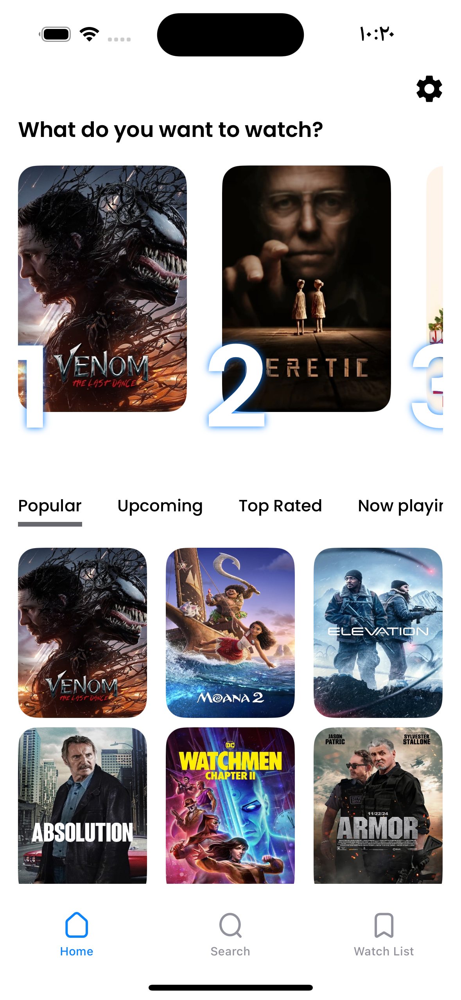
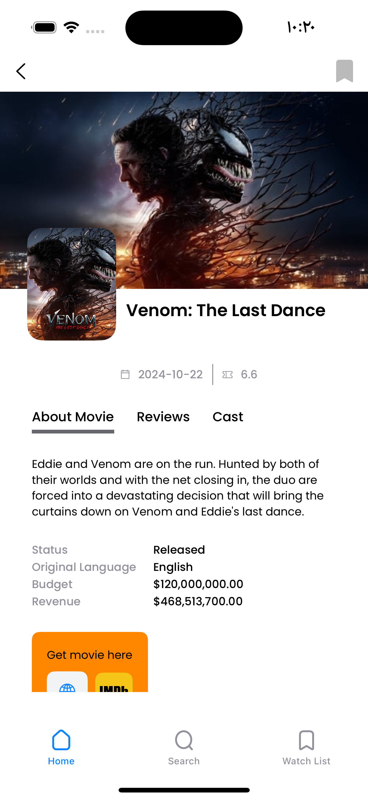
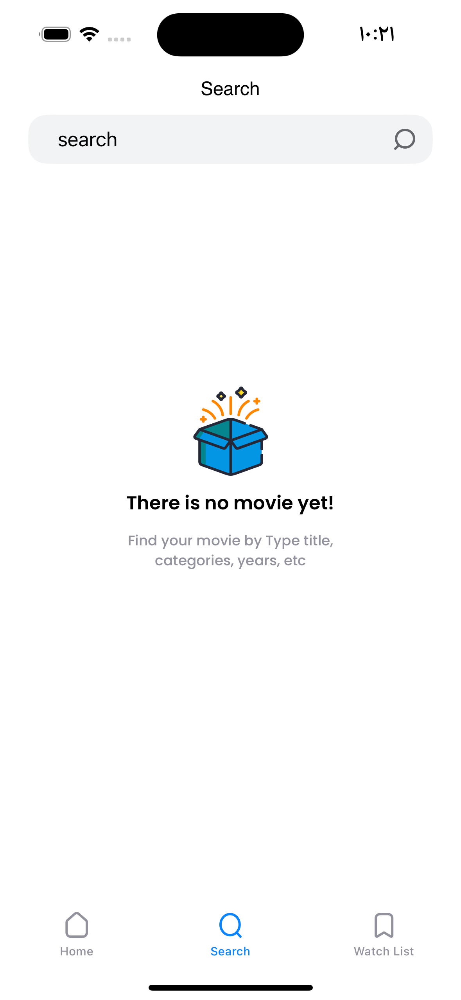
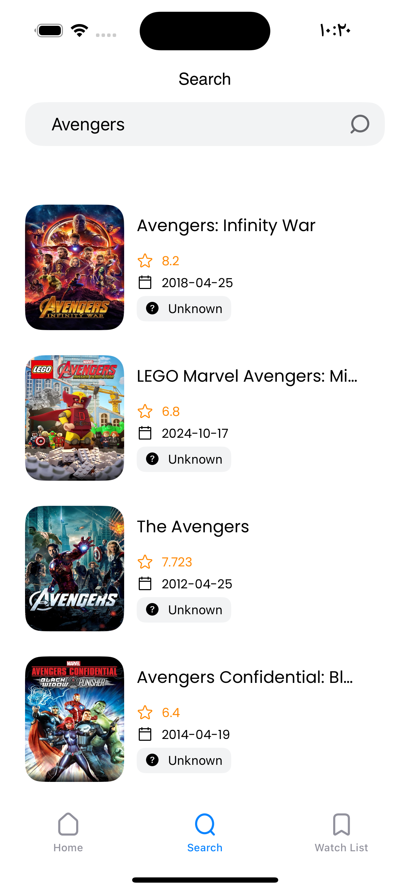
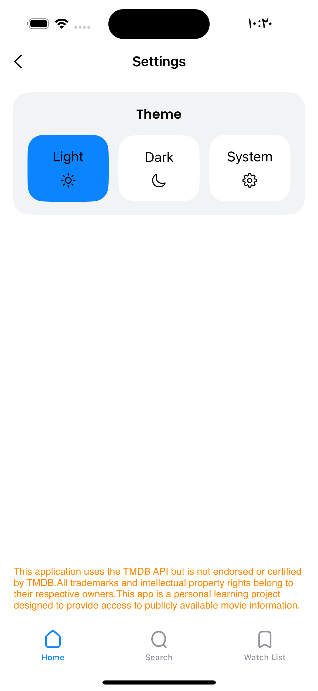
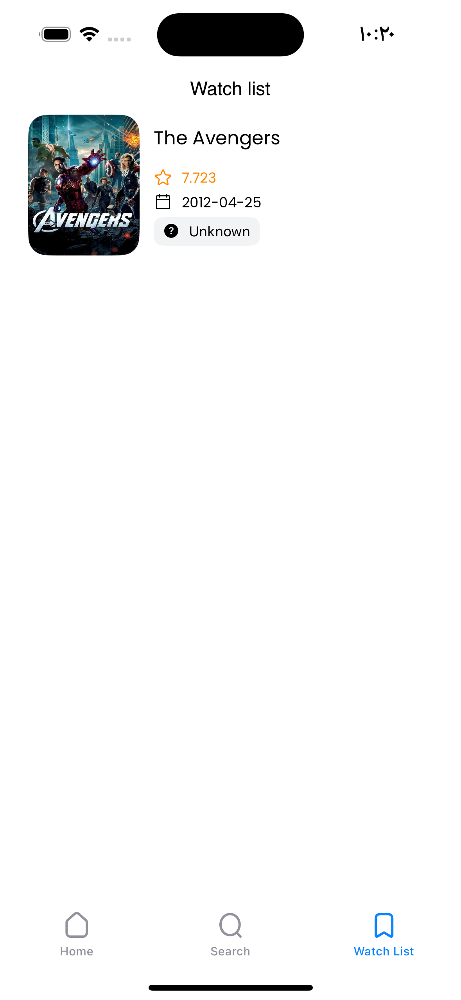

### Dark Mode

 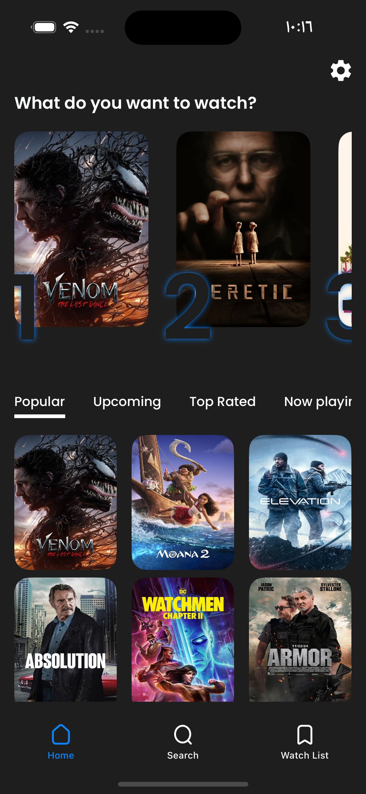
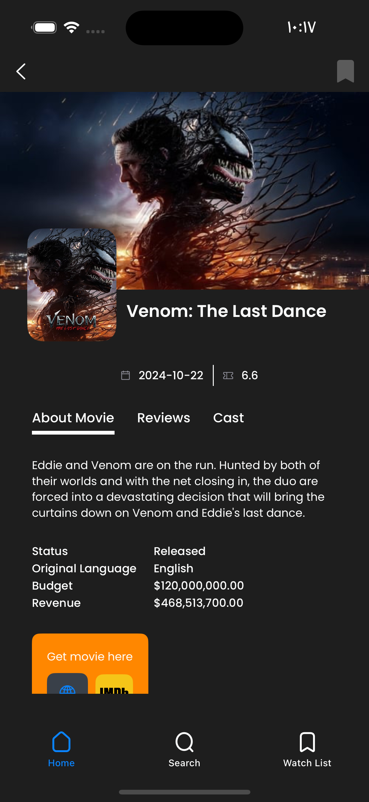
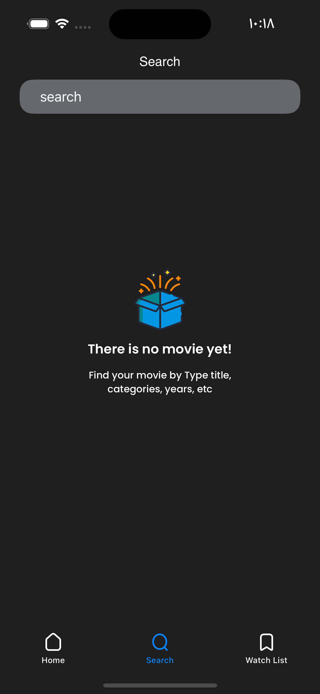
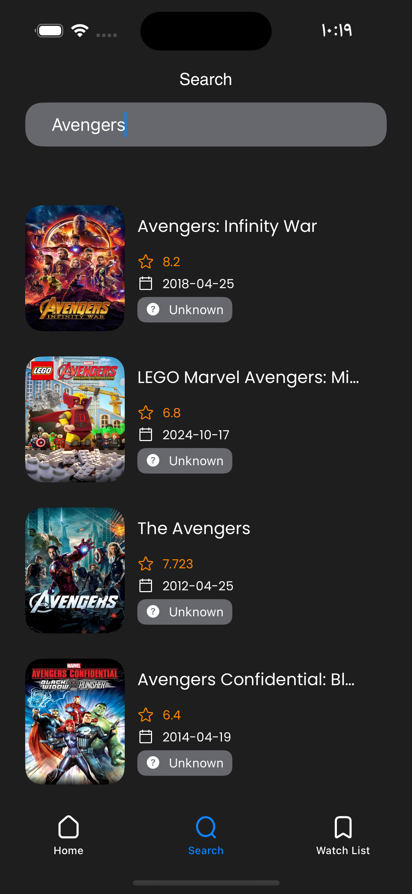
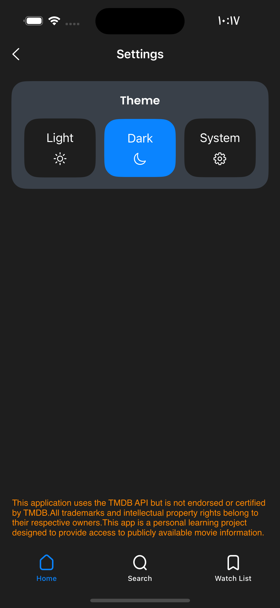
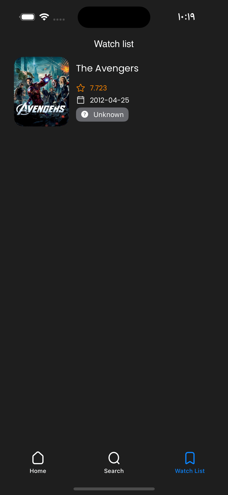
## V. Future Enhancements

* **User Authentication:** Implement user authentication (e.g., using Firebase, and TMDB sessions) to allow users to log in and sync their wishlists across devices.
* **Improved search functionality:** Keep track of user searches

